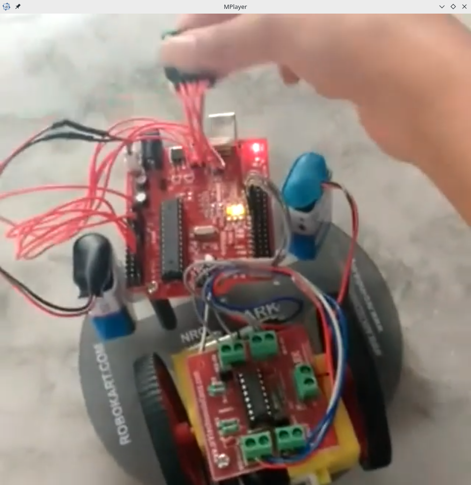
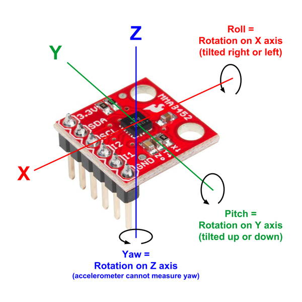

# GravityControlledBot
In this project, we will use an accelerometer to control a vehicle. The accelerometer can also be attached to any wearable hand accessories like gloves, bracelets, finger rings, etc making the project then gesture-controlled too. The project here is for wired use but it can be made wireless too.
We first create a simple car (construction similar to that of a line follower robot but this time without IR sensors), and interface it with an accelerometer. An accelerometer enables us to control the robot with our gestures.

# Methodology
Imagine all those remote-controlled cars, drones, and other electronic systems. How cool would it be if we were to control them using our hand gestures rather than having buttons that need to be pressed all the time?! The accelerometer gives us a 3D inclination analysis output of which can be used to control our robot here.
Here we provide a new approach to control systems and remove the bulky remotes and replace them with a single chip that's barely 4cmx4cm
Using these gesture-controlled devices is easy, efficient and fun!
# Hardware Specifications

<h4> Intel Galileo </h4>

The microcontroller used can be Intel Galileo is a microcontroller board based on the Intel® Quark SoC X1000 Application Processor, a 32-bit Intel Pentium-class system on a chip (datasheet). It’s the first board based on Intel® architecture designed to be hardware and software pin-compatible with Arduino shields designed for the Uno R3.

<b> Accelerometer </b>

An accelerator looks like a simple circuit for some larger electronic device. Despite its humble appearance, the accelerometer consists of many different parts and works in many ways, two of which are the piezoelectric effect and the capacitance sensor. The piezoelectric effect is the most common form of accelerometer and uses microscopic crystal structures that become stressed due to accelerative forces. These crystals create a voltage from the stress, and the accelerometer interprets the voltage to determine velocity and orientation.
The capacitance accelerometer senses changes in capacitance between microstructures located next to the device. If an accelerative force moves one of these structures, the capacitance will change and the accelerometer will translate that capacitance to voltage for interpretation.

The project also uses other common components like motor driver circuit, DC motors, additional power supply, etc
